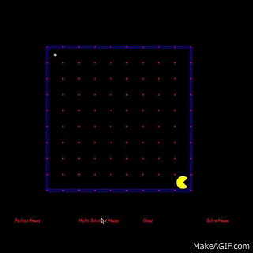
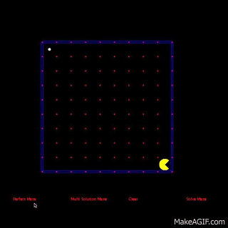

# PacmanMaze
Java experiment for maze generation and solving using Pacman.

## Multi-Solution Maze
Without doing any research, I attempted to write a maze solving algorithm myself. This attempt simply ensures that there are no squares on the grid that are bounded by more than 3 walls. Starting with all walls up, the algorithm picks a "dead end" and breaks one of the walls. This process is repeated until there are no more dead ends. This implementation is better to test the maze solver since among the multiple solutions, the search algorithm must find the most efficient.

## Perfect Maze
After the multi-solution maze, I read up on "perfect mazes", which have only one solution for a path between any two points. I implemented the recursize backtracking algorithm, which picks a cell, goes to an unvisited neighbor, and breaks the wall between them. If the algorithm reaches a point where there are still unvisited cells but the current cell has no neighbors (meaning that there are two points that cannot be connected), it "backtracks" to a point where it can try a different solution. 

